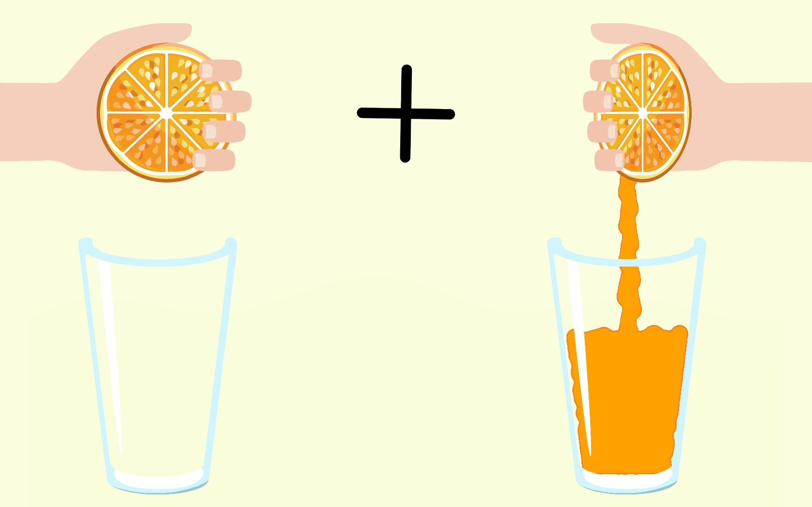

# bci-orange-squeezer

This is the user interface for the BCI training session developed using Unity. Users follow visual cues on the screen and perform multiple trials of motor execution and motor imagery tasks. Markers are sent to an LSL stream to be synchronized with the EEG data.

